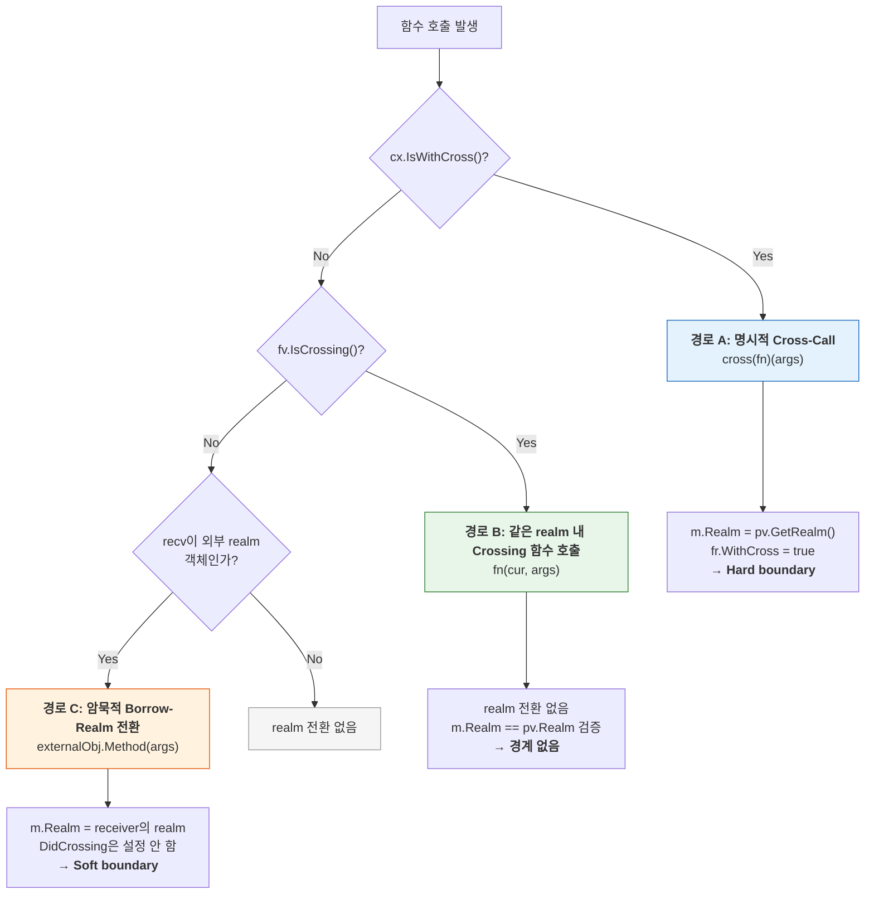
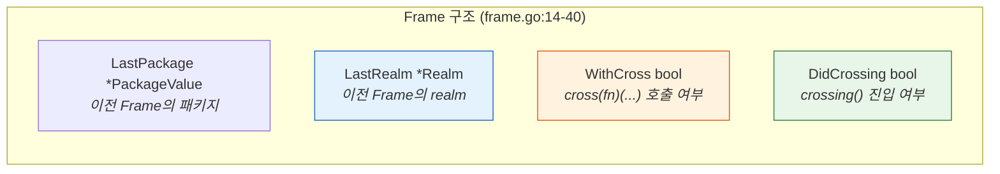
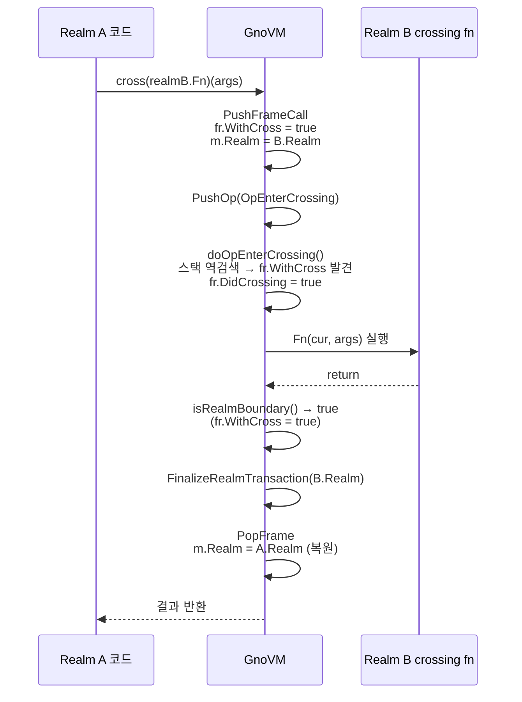
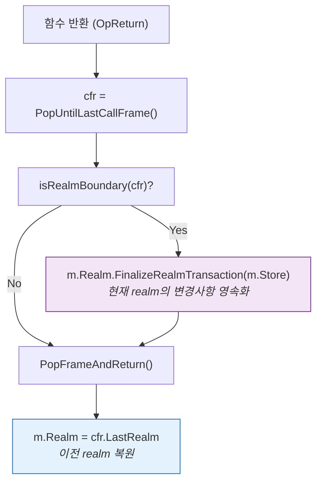
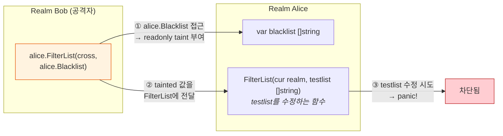
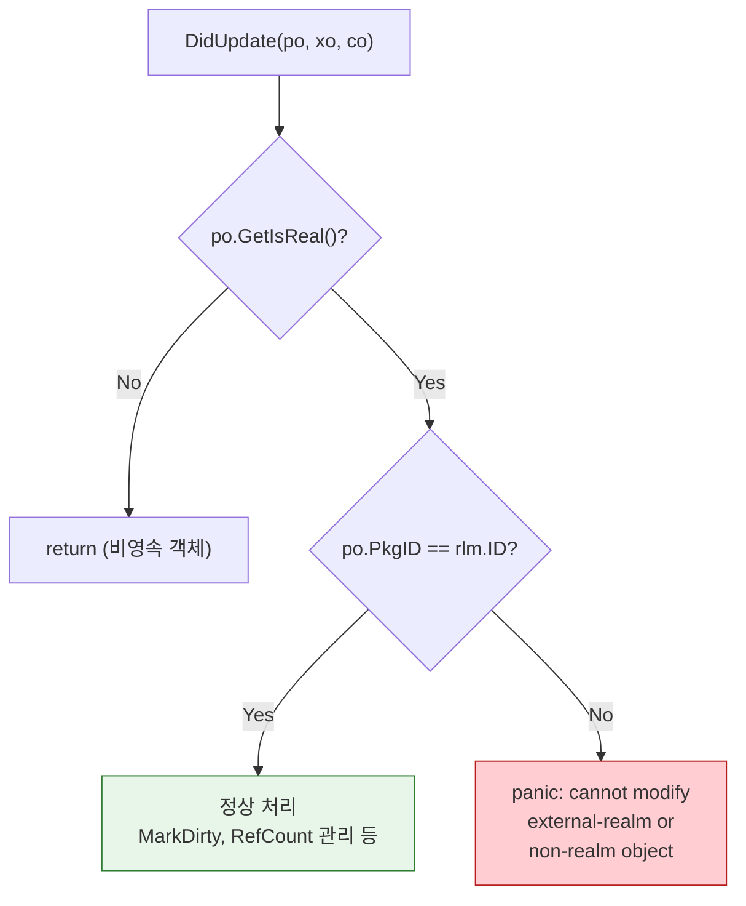
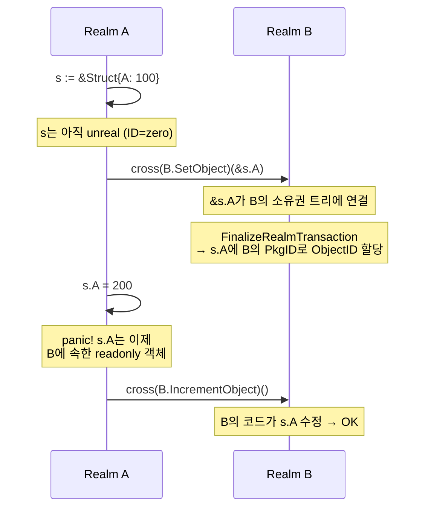
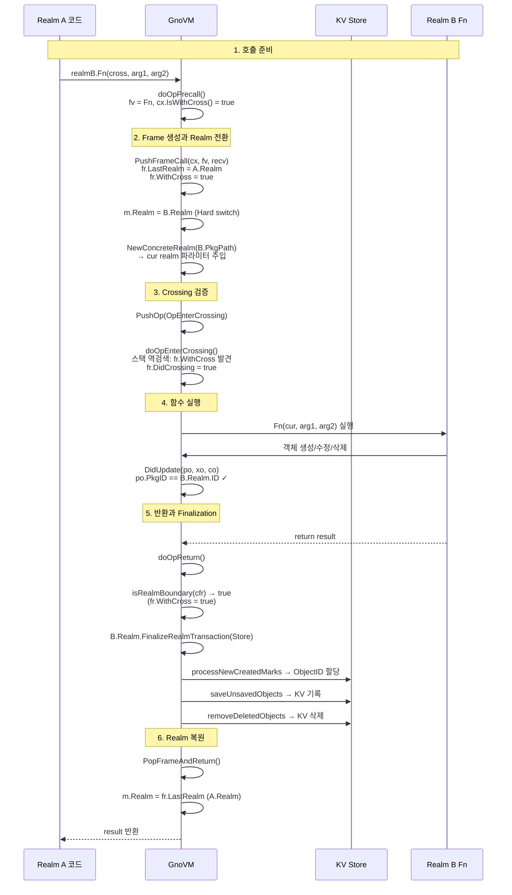

# GnoVM Cross-Realm 메커니즘 심층 분석

> 이 문서는 GnoVM의 realm 간 상호작용 메커니즘을 분석한 기술 참조 문서이다. 명시적 cross-call, 암묵적 borrow-realm 전환, readonly taint 보호, 그리고 realm 경계에서의 트랜잭션 마무리(finalization)까지 전체 흐름을 다룬다.
>
> **대상 코드베이스**: `gnovm/pkg/gnolang/` (machine.go, op_call.go, frame.go, realm.go, ownership.go)
>
> **공식 사양 문서**: `docs/resources/gno-interrealm.md`

---

## 1. 설계 원칙: 다중 사용자 프로그래밍 언어

Gno는 단일 사용자를 위한 전통적 프로그래밍 언어와 근본적으로 다른 전제에서 출발한다. 모든 현대 프로그래밍 언어는 한 명의 프로그래머가 하나의 프로그램을 작성한다는 가정 위에 설계되었으며, 라이브러리 임포트는 같은 사용자의 프로그램 구성요소를 결합하는 메커니즘이다. 반면 Gno는 대규모의 프로그래머들이 하나의 공유 프로그램(Gno.land)을 반복적이고 상호작용적으로 개발하는 다중 사용자 프로그래밍 언어로 설계되었다. 이 관점에서 realm은 각 사용자의 독립된 메모리 공간이며, cross-realm 호출은 사용자 간 경계를 넘는 시스템 콜에 비유할 수 있다.

이 설계의 핵심 원칙은 **쓰기 접근의 지역성(write access locality)**이다. 객체는 자신이 속한 realm의 코드에 의해서만 수정될 수 있다. 외부 realm은 해당 객체를 읽을 수 있지만, 직접 수정하려고 하면 런타임 panic이 발생한다. 수정이 필요하면 해당 realm이 제공하는 crossing 함수나 메서드를 통해서만 가능하다. 이것은 Unix/Linux에서 사용자 프로세스가 커널 시스콜을 통해서만 커널 자원에 접근할 수 있는 것과 유사하지만, GnoVM은 사용자 간의 cross-call도 지원한다는 점에서 전통적 운영체제보다 더 완전한 다중 사용자 시스템이다.

---

## 2. Realm 전환의 세 가지 경로

GnoVM에서 현재 실행 realm이 전환되는 경로는 정확히 세 가지다. 각 경로는 `PushFrameCall`(`machine.go:1908-1994`)에서 처리되며, 전환의 성격과 부수효과가 서로 다르다.

### 2.1 경로 A: 명시적 Cross-Call (Hard Boundary)

`cross(fn)(args)` 구문으로 호출할 때 발생한다(`machine.go:1911-1929`). 호출되는 함수는 반드시 crossing 함수(첫 번째 파라미터가 `cur realm`)여야 하며, 아니면 panic이 발생한다. 이 경로에서는 `m.Realm`이 호출 대상 패키지의 realm으로 교체되고, Frame에 `WithCross = true`가 설정된다. 이것은 realm 간 가장 강력한 경계(hard boundary)로, 함수가 반환될 때 반드시 `FinalizeRealmTransaction`이 호출된다. 같은 realm을 대상으로 하더라도(`crlm == prlm`) finalization이 발생한다는 점이 특이하다. 이것은 객체 소속(attachment) 규칙의 일관성을 유지하기 위함이다.

cross-call 시 호출 대상 함수의 첫 번째 `cur realm` 파라미터 자리에는 `NewConcreteRealm(fv.PkgPath)`로 생성된 realm 값이 자동으로 주입된다(`op_call.go:29-42`). 이 값은 `std.CurrentRealm()`을 통해 접근할 수 있으며, 호출 대상 realm의 주소와 경로 정보를 담는다.

### 2.2 경로 B: 같은 Realm 내 Crossing 함수 호출

crossing 함수를 `fn(cur, args)` 구문으로 호출할 때 발생한다(`machine.go:1932-1955`). 이 경우 `m.Realm`과 호출 대상 패키지의 realm이 같아야 하며, 다르면 "cannot cur-call to external realm function" panic이 발생한다. realm 전환이 발생하지 않으므로 realm 경계도 없고 finalization도 일어나지 않는다. 이 경로는 같은 realm 내에서 crossing 함수를 일반 함수처럼 호출하는 편의를 제공한다.

### 2.3 경로 C: 암묵적 Borrow-Realm 전환 (Soft Boundary)

외부 realm에 속한 객체의 메서드를 호출할 때 발생한다(`machine.go:1957-1993`). 예를 들어, realm A의 코드에서 realm B에 저장된 `obj`의 메서드 `obj.Method()`를 호출하면, VM은 `obj`의 ObjectID에서 PkgID를 추출하고, 해당 패키지의 realm으로 `m.Realm`을 전환한다. 이 전환을 "borrow"라 부르는 이유는, 메서드 실행 동안 일시적으로 receiver의 저장 realm을 빌려 쓰기 때문이다.

borrow-realm 전환의 중요한 특성은 `DidCrossing` 플래그가 설정되지 않는다는 것이다. 이것은 의도적인 설계 결정으로, `std.CurrentRealm()`의 반환값이 borrow에 의해 변하지 않도록 하기 위함이다. 코드의 주석(`machine.go:1978-1986`)은 이 결정의 이유를 다음과 같이 설명한다. "DidCrossing은 오직 명시적 `cross(fn)(...)`호출과 그로부터 파생되는 같은 realm 내 crossing 함수 호출에서만 발생해야 한다. 그렇지 않으면 DidCrossing의 발생 여부가 receiver가 어디에 저장되어 있느냐에 의존하게 되어 혼란을 초래한다." 공식 사양의 비유를 빌리면, "다른 사람의 펜으로 서명해도 여전히 당신의 서명이다 — 서명(current realm) : 펜(borrow realm)."

---

## 3. Frame과 Realm 상태 추적

### 3.1 Frame 구조

모든 함수 호출은 Frame(`frame.go:14-40`)을 생성하며, 각 Frame은 호출 시점의 realm 상태를 보존한다.

`PushFrameCall`(`machine.go:1850-1877`)에서 Frame이 생성될 때, 현재 `m.Realm`이 `LastRealm`에 저장된다. 함수가 반환되어 Frame이 pop될 때(`machine.go:2073`), `m.Realm`은 `fr.LastRealm`으로 복원된다. 이 save/restore 패턴이 realm 전환의 스택 기반 관리를 가능하게 한다.

### 3.2 OpEnterCrossing — Crossing 함수 진입 검증

crossing 함수가 호출되면 `OpEnterCrossing`이 실행된다(`op_call.go:88-135`). 이 연산은 Gno 0.9 이전의 `crossing()` 내장 함수를 대체한 것으로, 호출 스택을 역방향으로 검색하여 유효한 cross-call 또는 이미 검증된 DidCrossing Frame을 찾는다. 찾으면 현재 Frame에 `DidCrossing = true`를 설정하고, 찾지 못하면 panic을 발생시킨다. 이 검증은 crossing 함수가 반드시 적법한 cross-call 체인 내에서만 실행되도록 보장한다.

---

## 4. Realm 경계 판정과 Finalization

### 4.1 isRealmBoundary

함수 반환 시 `isRealmBoundary`(`op_call.go:226-263`)가 realm 경계 여부를 판정한다. 이 함수는 세 가지 조건을 검사한다.

첫째, `fr.WithCross == true`이면 무조건 경계다. 같은 realm으로의 cross-call도 경계로 간주되며, 이것은 객체 소속 규칙의 일관성을 위한 것이다.

둘째, `crlm != prlm`이면 경계다. 이것은 암묵적 borrow-realm 전환(경로 C)에서 발생하는 경우다.

셋째, 전체 머신의 마지막 Frame(`NumFrames() == 1`)에서 반환할 때도 경계로 간주된다. 다만 `StageAdd` 단계(패키지 추가 시 변수 초기화 중)에서는 예외다. 이 예외가 없으면, 변수 선언 중 호출되는 함수가 반환될 때 아직 완성되지 않은 패키지 Block의 미완성 객체가 finalization 대상이 되어 panic이 발생할 수 있다.

### 4.2 Finalization 호출 시점

Finalization은 realm별(per-realm)로 수행된다. `m.Realm.FinalizeRealmTransaction(m.Store)`는 현재 realm의 `created`, `updated`, `deleted` 리스트만 처리한다. 호출 스택에서 여러 realm을 거치면, 각 realm의 경계를 넘을 때마다 해당 realm의 finalization이 개별적으로 수행된다.

Finalization 순서는 호출 스택의 반환 순서를 따른다. realm A가 realm B를 호출하고, realm B가 realm C를 호출했다면, C의 finalization이 가장 먼저, A의 finalization이 가장 나중에 수행된다. 이 LIFO 순서는 중첩된 realm 호출에서 자식 realm의 변경이 부모 realm의 finalization 시점에 이미 KV 스토어에 기록되어 있음을 보장한다.

---

## 5. Readonly Taint — 외부 Realm 객체 보호

### 5.1 Taint 메커니즘

외부 realm의 객체에 selector(`externalrealm.Field`)나 index(`externalslice[0]`) 표현식으로 접근하면, 결과 값에 `N_Readonly` 속성이 부여된다. 이 속성은 "taint"라 불리며, 한번 부여되면 해제할 수 없다. tainted 값에서 파생된 모든 값도 자동으로 tainted된다.

`Machine.IsReadonly`(`machine.go:2231-2250`)는 다음 조건 중 하나라도 참이면 true를 반환한다. `m.Realm`이 nil인 경우(단일 사용자 모드), 값이 외부 패키지의 RefValue인 경우, 값에 `N_Readonly` 플래그가 설정된 경우, 값의 첫 번째 Object의 PkgID가 현재 realm의 ID와 다른 경우가 그 조건들이다.

값 할당 시 `PopAsPointer2`(`machine.go:2256`)가 readonly 검사를 수행하고, readonly인 경우 `PopAsPointer`(`machine.go:2212`)가 panic을 발생시킨다. 에러 메시지는 `"cannot directly modify readonly tainted object (w/o method): <expr>"`이다.

### 5.2 Taint가 적용되지 않는 경우

함수나 메서드의 반환값에는 readonly taint가 적용되지 않는다. 이것은 의도적인 설계로, realm이 자신의 내부 상태에 대한 제어된 접근을 제공할 수 있게 한다. 예를 들어, `func (eo Object) GetField() any { return eo.Field }`의 반환값은 tainted가 아니다. 반환된 객체의 필드는 여전히 외부 realm에서 직접 수정할 수 없지만, 해당 realm의 crossing 함수에 인자로 전달하여 수정을 요청할 수 있다.

### 5.3 Readonly Taint의 보안 함의

taint 메커니즘은 단순히 외부 객체 보호만을 위한 것이 아니다. 공식 사양은 다음과 같은 공격 시나리오를 설명한다. realm A가 `FilterList(cur realm, testlist []string)` 함수를 제공하고, 이 함수가 전달받은 `testlist`를 수정한다고 하자. 만약 taint 없이 `alice.FilterList(cross, alice.Blacklist)`를 호출할 수 있다면, 외부에서 alice의 내부 blacklist를 변조할 수 있다. taint 메커니즘은 `alice.Blacklist`에 접근한 순간 readonly가 되므로, 이를 `FilterList`에 전달하면 해당 함수 내부에서 수정 시도 시 panic이 발생한다.

---

## 6. DidUpdate의 Cross-Realm 보호

`DidUpdate`(`realm.go:200-201`)는 cross-realm 수정을 감지하는 최종 방어선이다. 이 함수는 `po.GetObjectID().PkgID != rlm.ID`를 검사하여, 현재 realm의 코드가 다른 realm의 객체를 직접 수정하려는 시도를 차단한다.

이 검사는 readonly taint와는 독립적으로 작동하는 별도의 보호 계층이다. readonly taint는 컴파일/전처리 단계에서 값 접근 패턴을 기반으로 부여되지만, DidUpdate의 PkgID 검사는 런타임에 실제 객체의 소속을 확인한다. 두 메커니즘이 모두 필요한 이유는, readonly taint만으로는 모든 수정 경로를 차단할 수 없기 때문이다. 예를 들어, 메서드 호출을 통해 borrow-realm으로 전환된 상태에서 해당 realm의 객체를 수정하는 것은 readonly taint로는 감지할 수 없지만, DidUpdate의 PkgID 검사가 최종적으로 보호한다.

---

## 7. 객체 소속(Attachment)과 Realm 간 객체 이동

### 7.1 객체가 Realm에 소속되는 시점

새로 생성된 객체는 처음에는 어떤 realm에도 속하지 않는다(ObjectID가 zero). 이 객체가 특정 realm의 소유권 트리에 연결되면(`DidUpdate`에서 `co.SetOwner(po)` + `MarkNewReal`), 해당 realm에 소속된다. 소속은 `FinalizeRealmTransaction`의 `processNewCreatedMarks`에서 ObjectID가 할당될 때 확정되며, 이후 해당 객체의 PkgID는 해당 realm의 ID가 된다.

### 7.2 Cross-Realm 참조와 소유권

한 realm의 crossing 함수에 다른 realm에서 생성된 객체를 전달하면, 그 객체는 호출된 realm의 소유권 트리에 연결될 수 있다. 이 경우 객체의 PkgID는 호출된 realm의 ID가 되며, 원래 realm에서 해당 객체는 readonly가 된다.

이 메커니즘에서 주목할 점은 구조체의 일부 필드만 다른 realm에 소속될 수 있다는 것이다. `crossrealm25a.gno` 테스트는 `&s.A`(구조체 필드의 포인터)를 다른 realm에 전달하는 시나리오를 다루며, 이 경우 HeapItemValue가 외부 realm에 소속되지만 구조체 자체는 원래 realm에 남을 수 있다.

---

## 8. Realm 전환의 전체 호출 흐름

realm A에서 realm B의 crossing 함수를 호출하는 전체 흐름을 단계별로 추적한다.

---

## 9. 암묵적 Borrow와 명시적 Cross의 차이 요약

```mermaid
flowchart TB
    subgraph "명시적 Cross-Call"
        direction TB
        EC1["구문: fn(cross, args)"]
        EC2["m.Realm 전환: Yes (hard)"]
        EC3["fr.WithCross: true"]
        EC4["fr.DidCrossing: true"]
        EC5["std.CurrentRealm() 변경: Yes"]
        EC6["Finalization: 반드시 발생"]
        EC7["같은 realm 허용: Yes"]
    end

    subgraph "암묵적 Borrow"
        direction TB
        IC1["구문: externalObj.Method(args)"]
        IC2["m.Realm 전환: Yes (soft)"]
        IC3["fr.WithCross: false"]
        IC4["fr.DidCrossing: false"]
        IC5["std.CurrentRealm() 변경: No"]
        IC6["Finalization: realm 다르면 발생"]
        IC7["receiver 수정: 가능"]
    end

    style EC1 fill:#e3f2fd,stroke:#1565c0
    style IC1 fill:#fff3e0,stroke:#e65100
```

이 구분의 핵심은 `std.CurrentRealm()`에 있다. 명시적 cross-call은 CurrentRealm을 변경하지만, 암묵적 borrow는 변경하지 않는다. 이것은 코인 전송 등 realm 주소에 의존하는 연산에서 중요한 차이를 만든다. borrow-realm에서 `std.CurrentRealm()`을 호출하면 cross-call을 수행한 원래 realm이 반환되므로, borrow 중에도 코인 전송의 주체는 명시적으로 cross-call한 realm이다.

---

## 부록 A. 주요 함수 참조 테이블

| 함수명 | 파일:라인 | 역할 |
|--------|-----------|------|
| `PushFrameCall` | `machine.go:1850` | Frame 생성, realm 전환 로직의 핵심 |
| `doOpPrecall` | `op_call.go:9` | 함수 호출 전처리, WithCross/Crossing 분기 |
| `doOpEnterCrossing` | `op_call.go:88` | crossing 함수 진입 검증 |
| `isRealmBoundary` | `op_call.go:226` | realm 경계 판정 |
| `maybeFinalize` | `op_call.go:267` | 조건부 finalization 호출 |
| `doOpReturn` | `op_call.go:273` | 함수 반환, finalization 트리거 |
| `DidUpdate` | `realm.go:178` | PkgID 검사를 통한 cross-realm 수정 방지 |
| `IsReadonly` | `machine.go:2231` | readonly taint 검사 |
| `PopAsPointer2` | `machine.go:2256` | 할당 시 readonly 검사 수행 |
| `IsReadonlyBy` | `ownership.go:428` | PkgID 기반 외부 realm 객체 판별 |
| `FinalizeRealmTransaction` | `realm.go:365` | realm별 트랜잭션 마무리 |
| `NewConcreteRealm` | `uverse.go:191` | cur realm 파라미터 값 생성 |

## 부록 B. Cross-Realm 테스트 파일 위치

주요 테스트 시나리오는 `gnovm/tests/files/zrealm_crossrealm*.gno`에 50개 이상 존재하며, 다음과 같은 시나리오를 다룬다. 외부 객체의 기본적인 readonly 보호(`crossrealm2`), 메서드를 통한 수정 허용(`crossrealm3`), 포인터를 통한 부분 소속 이전(`crossrealm25a`), 중첩된 realm 호출(`crossrealm15`), panic 발생 시 realm 경계에서의 트랜잭션 롤백(`crossrealm30`) 등이 포함된다.
