# GnoVM 객체 영속성 시스템 심층 분석

> 이 문서는 GnoVM의 Realm 트랜잭션 처리, 객체 소유권 트리, 직렬화/역직렬화 경로, dirty 전파 메커니즘에 대한 기술 참조 문서이다. 인라인 직렬화 최적화 시도 과정에서 축적된 분석을 바탕으로 작성되었으며, 향후 유사한 최적화를 설계할 때 참고할 수 있도록 시스템의 불변식과 숨겨진 의존관계를 상세히 기록한다.
>
> **대상 코드베이스**: `gnovm/pkg/gnolang/` (realm.go, ownership.go, store.go, values.go)

---

## 1. 설계 철학: 소유권 트리와 "현실성"

GnoVM은 블록체인 스마트 컨트랙트를 위해 설계되었다. 모든 realm 패키지(`gno.land/r/...`)는 패키지 레벨 변수들을 루트로 하는 소유권 트리(ownership tree)를 가지며, 이 트리에 매달린 모든 객체는 트랜잭션이 끝날 때 자동으로 영속화된다. 소유권 트리에 속하지 않는 객체는 "현실적이지 않은(unreal)" 것으로 간주되어 가비지 컬렉션의 대상이 된다.

이 시스템에서 "real"이라는 단어는 단순한 플래그가 아니라 존재론적 의미를 갖는다. `ObjectInfo.GetIsReal()`이 true를 반환한다는 것은 해당 객체가 ObjectID를 부여받았고, KV 스토어에 독립된 엔트리로 영속화되었거나 영속화될 예정이라는 뜻이다. 반대로 ObjectID가 zero인 객체는 아직 영속화 경계를 넘지 못한 임시 존재다. 이 구분은 시스템 전반에 걸쳐 분기 조건으로 사용되며, 특히 `DidUpdate` 함수의 초반부에서 `!po.GetIsReal()`일 때 즉시 반환하는 패턴은 모든 dirty 전파의 전제조건이 된다.

소유권은 단일 소유(RefCount == 1)가 기본이며, 동일 객체를 두 곳 이상에서 참조하면 "escape"라 불리는 상태로 전환된다. escape된 객체는 소유자가 없고, IAVL 트리에 별도의 해시를 기록하여 Merkle proof에 참여한다. 이 이중 저장 구조는 단일 소유 객체의 경우 부모의 해시에 자식의 해시가 포함되므로 별도의 IAVL 엔트리가 불필요하지만, 공유 객체는 어느 부모에도 속하지 않으므로 독립적인 Merkle 증명 경로를 가져야 한다는 요구사항에서 비롯된다.

### 1.1 타입 이론적 정형화

위의 소유권 모델은 서브구조적 타입 시스템(substructural type system)의 언어로 정형화할 수 있다. 이 절에서는 세 가지 핵심 구조, 즉 현실성 술어, 참조 카운트에 의한 모드 전환, 해시 합성의 재귀적 구조를 수식으로 정의한다.

**현실성 술어.** ObjectID의 집합을 $I$, 할당되지 않은 zero ID를 $\varepsilon \in I$로 쓴다. 현실성 술어 $\text{Real}: O \to \mathbb{B}$는 $\text{Real}(o) \iff \text{id}(o) \neq \varepsilon$로 정의된다. real 객체의 집합 $O_{\text{real}} = \{o \in O \mid \text{id}(o) \neq \varepsilon\}$는 의존 타입의 정제(refinement type)에 해당한다. 소유권 함수 $\text{own}: O \to O \cup \{\bot\}$에 대해, escape되지 않은 real 객체는 반드시 real 소유자를 가져야 한다는 불변식이 성립한다.

$$\forall o \in O_{\text{real}},\quad \neg\text{Escaped}(o) \implies \text{own}(o) \neq \bot \;\land\; \text{Real}(\text{own}(o))$$

이 불변식은 `MarkNewReal`의 디버그 검증 조건(`realm.go:252-258`)과 대응한다. $\text{own}$을 반복 적용하면 유한 단계 내에 PackageValue에 도달해야 한다는 정초성(well-foundedness) 조건이 `markDirtyAncestors`의 종료를 보장한다.

**서브구조적 모드 전환.** 참조 카운트 $\text{rc}(o)$의 값에 따라 객체의 서브구조적 분류가 결정된다. GnoVM의 소유권 모델은 선형 타입(linear type)의 "정확히 한 번 사용" 제약을 런타임 참조 카운트로 동적 관리하는 시스템이다.

$$\text{mode}(o) = \begin{cases} \textbf{lin} & \text{if } \text{rc}(o) = 1 \quad \text{(단일 소유, 소유권 트리에 속함)} \\ \textbf{unr} & \text{if } \text{rc}(o) > 1 \quad \text{(escape, 소유권 트리에서 분리)} \\ \textbf{aff} & \text{if } \text{rc}(o) = 0 \quad \text{(삭제 대상)} \end{cases}$$

모드 전환은 `DidUpdate`에서 `IncRefCount`/`DecRefCount`를 통해 발생하며, 각 전환에 고유한 부수효과가 수반된다. $\textbf{lin} \xrightarrow{\text{Inc}} \textbf{unr}$일 때 소유자가 해제되고 escape 마킹이 발생하며($\text{own}(o) \leftarrow \bot$), $\textbf{lin} \xrightarrow{\text{Dec}} \textbf{aff}$일 때 삭제 마킹이 발생한다. $\textbf{unr} \xrightarrow{\text{Dec, rc}=1} \textbf{lin}$은 `processNewEscapedMarks`의 demote 분기에서 처리된다.

**해시 합성의 재귀 구조.** 해시 함수 $H: O_{\text{real}} \to \{0,1\}^{160}$는 소유권 트리 위의 상향 합성 함수(bottom-up compositional function)다. 객체 $o$의 자식 집합 $\{c_1, \ldots, c_k\}$에 대해,

$$H(o) = \text{SHA256}\!\Big(\text{amino}\big(o\,[c_i \mapsto \texttt{RefValue}\{H(c_i)\}]\big)\Big)\Big|_{20}$$

이 구조가 소유권 트리를 Merkle 트리로 만든다. leaf 객체 하나가 변경되면 루트까지의 경로 위 모든 해시가 재계산되어야 하며, 이것이 `markDirtyAncestors`가 존재하는 수학적 이유다. dirty 전파는 $\text{own}$의 역관계의 반사-전이적 폐포를 따른다. 즉, $\text{dirty}(o) \implies \forall o' \in \text{own}^{*-1}(o),\ \text{dirty}(o')$이다.

---

## 2. 핵심 데이터 구조

### 2.1 ObjectInfo — 모든 영속 객체의 메타데이터

`ObjectInfo`(`ownership.go:149-178`)는 모든 영속 가능한 값 타입에 임베딩되는 구조체로, 객체의 정체성과 생명주기 상태를 담는다. 공개 필드와 비공개 필드가 섞여 있으며, amino 직렬화 시에는 공개 필드만 포함되고 비공개 플래그들은 트랜잭션 실행 중에만 메모리에 존재한다는 점이 중요하다.

```
ObjectInfo 구조 (ownership.go:149-178)
┌──────────────────────────────────────────────────────────┐
│ [직렬화되는 공개 필드]                                      │
│  ID          ObjectID   객체의 고유 식별자                  │
│  Hash        ValueHash  마지막 직렬화 결과의 SHA256 해시     │
│  OwnerID     ObjectID   소유자 객체의 ID                    │
│  ModTime     uint64     마지막 수정 시간(realm 카운터)       │
│  RefCount    int        참조 카운트 (0이면 GC 대상)          │
│  IsEscaped   bool       다중 참조로 인한 escape 여부         │
│                                                          │
│ [비공개 런타임 전용 필드]                                    │
│  isDirty       bool     현재 트랜잭션에서 수정됨              │
│  isDeleted     bool     영구 삭제됨                         │
│  isNewReal     bool     현재 트랜잭션에서 새로 생성됨          │
│  isNewEscaped  bool     현재 트랜잭션에서 새로 escape됨       │
│  isNewDeleted  bool     현재 트랜잭션에서 삭제 예정            │
│  owner         Object   소유자 객체의 메모리 참조(캐시)        │
└──────────────────────────────────────────────────────────┘
```

`ID`는 `PkgID`(realm의 SHA256 해시 첫 20바이트)와 `NewTime`(realm의 단조 증가 카운터)으로 구성된다. KV 스토어의 키는 `"oid:" + hex(PkgID) + ":" + NewTime` 형식이 된다. `GetIsReal()`은 단순히 `!oi.ID.IsZero()`를 반환하며, ID가 할당되는 시점은 `FinalizeRealmTransaction` 내부의 `processNewCreatedMarks`에서 `assignNewObjectID`가 호출될 때다. 즉, 트랜잭션 실행 중에는 새로 생성된 객체의 ID가 zero이고, 마무리 단계에서 비로소 "현실"이 된다.

`owner` 필드는 amino 직렬화에 포함되지 않는다. 대신 `OwnerID`만 저장되며, 역직렬화 후 `getOwner(store, oo)` 호출 시 `OwnerID`를 사용해 스토어에서 소유자를 로드하고 `owner` 필드에 캐시한다.

### 2.2 값 타입 계층과 Object 인터페이스

GnoVM의 모든 값은 `Value` 인터페이스를 구현하지만, 영속화 대상이 되는 것은 `Object` 인터페이스를 구현하는 타입들뿐이다. Object는 `ObjectInfo`를 임베딩하여 ID, 해시, 소유자, 참조 카운트 등의 메타데이터를 갖는다.

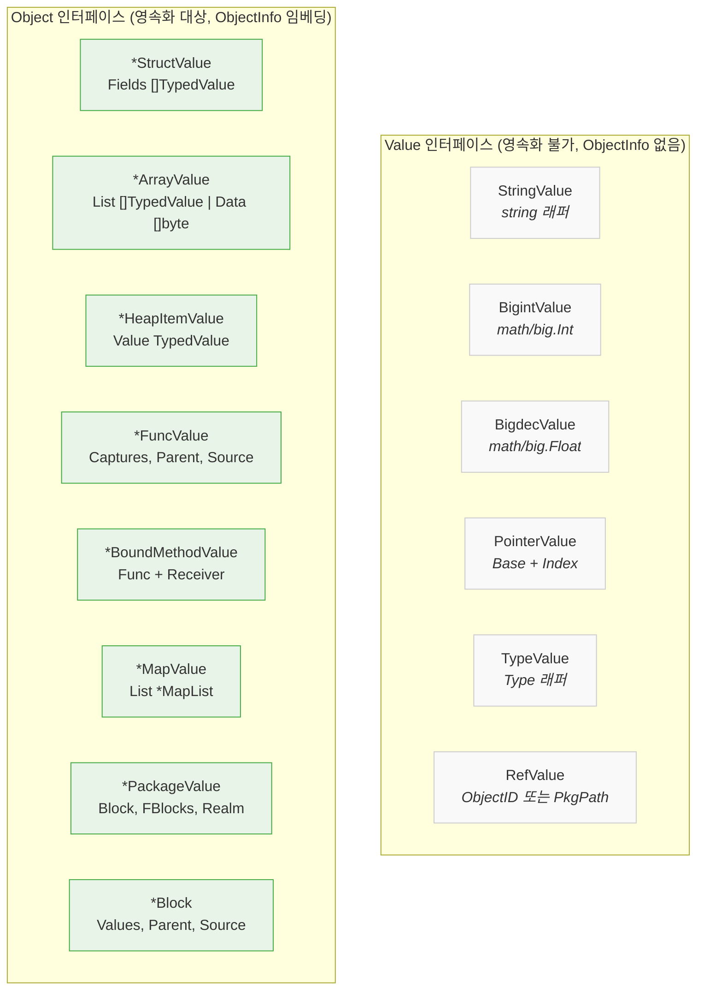

이 계층에서 핵심적인 구분점은 `Object`인가 아닌가이다. `refOrCopyValue`(`realm.go:1776-1787`)는 `TypedValue`를 직렬화용으로 변환할 때, 값이 Object이면 `toRefValue`를 통해 `RefValue{ObjectID, Hash}`로 교체하고, Object가 아니면 `copyValueWithRefs`를 통해 재귀적으로 복사한다. 이것이 "모든 Object는 독립된 KV 엔트리를 갖는다"는 시스템의 근본 원칙이다.

`HeapItemValue`는 특별히 주목할 만한 타입이다. Go/Gno에서 `&x` 연산이나 클로저 캡처가 발생하면 값이 힙으로 탈출하는데, GnoVM은 이를 `HeapItemValue`로 래핑하여 독립 Object로 추적한다. avl.Tree의 각 노드는 `*Node` 포인터를 통해 참조되므로, 모든 노드가 HeapItemValue → StructValue(Node) 체인으로 연결되어 노드 하나당 최소 2개의 Object가 생성된다. 이것이 avl.Tree의 per-node 오버헤드(~300-500 bytes)의 주된 원인이다.

### 2.3 RefValue — 지연 로딩의 매개체

`RefValue`(`values.go:2570-2575`)는 아직 메모리에 로드되지 않은 Object를 가리키는 경량 참조다. Object가 아닌 Value이므로 ObjectInfo를 갖지 않으며, 직렬화 시 Object가 들어갈 자리에 대신 기록된다. RefValue에는 두 가지 형태가 있다. 첫째는 객체 참조로, `RefValue{ObjectID: "abc:42", Hash: <20bytes>}`의 형태이며 `store.GetObject("abc:42")`로 실제 Object를 로드한다. 둘째는 패키지 참조로, `RefValue{PkgPath: "gno.land/r/demo/users"}`의 형태이며 `store.GetPackage(...)`로 PackageValue를 로드한다.

VM이 실행 중에 `TypedValue.V`가 `RefValue`인 것을 만나면, `fillValueTV`(`values.go`)를 통해 실제 Object를 스토어에서 로드하고 `TypedValue.V`를 교체한다. 이 지연 로딩 메커니즘 덕분에 거대한 소유권 트리의 루트만 로드해도 실행이 시작될 수 있으며, 실제로 접근하는 경로의 객체만 메모리에 올라온다.

중요한 것은 RefValue 내부의 `Hash` 필드다. escape되지 않은 일반 객체의 RefValue에는 해당 객체의 마지막 직렬화 해시가 포함된다. 이를 통해 부모의 해시 = SHA256(부모 데이터 + 자식들의 해시 연쇄)가 성립하며, 소유권 트리 전체가 일종의 Merkle 트리를 형성한다. escape된 객체는 Hash 대신 `Escaped: true` 플래그만 갖고, 해시는 IAVL 트리에서 별도 관리된다.

---

## 3. 직렬화 경로: Object에서 KV 엔트리까지

### 3.1 SetObject의 전체 흐름

`store.SetObject`(`store.go:619-700`)는 하나의 Object를 KV 스토어에 기록하는 함수다.

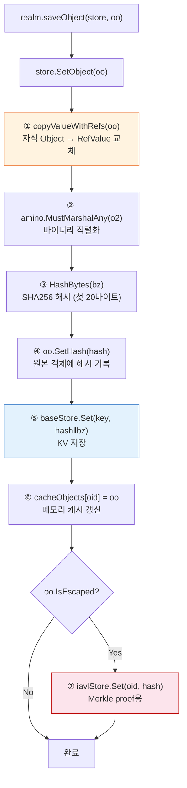

1단계에서 `copyValueWithRefs`는 원본 객체의 깊은 복사본을 만들되, 자식 Object는 모두 `RefValue`로 교체한다. 이때 `refOrCopyValue` → `toRefValue` 경로가 사용된다. `toRefValue`는 대상 Object가 real이어야 하며(ObjectID가 할당되어 있어야 하며), 아니면 panic한다. 이것이 `saveUnsavedObjectRecursively`가 "자식을 먼저 저장하고, 그 다음 자신을 저장"하는 bottom-up 순서를 강제하는 이유다. 자식이 먼저 저장되어야 ObjectID와 Hash가 확정되고, 부모의 직렬화에서 유효한 RefValue를 생성할 수 있다.

5단계에서 KV 스토어에 기록되는 값의 형식은 `[Hash 20바이트][amino 바이너리 N바이트]`다. 키는 `"oid:" + hex(PkgID) + ":" + NewTime`이다. 해시를 값의 앞부분에 포함시키는 이유는, 객체를 로드할 때 amino 역직렬화 없이도 해시를 즉시 확인할 수 있게 하기 위함이다.

### 3.2 copyValueWithRefs의 재귀 구조

`copyValueWithRefs`(`realm.go:1324-1482`)는 값 타입별로 분기하여 직렬화용 복사본을 생성한다. 핵심 패턴은 모든 타입에서 동일하다. 아래 다이어그램은 StructValue를 예로 들어 Object 필드가 RefValue로 교체되는 과정을 보여준다.

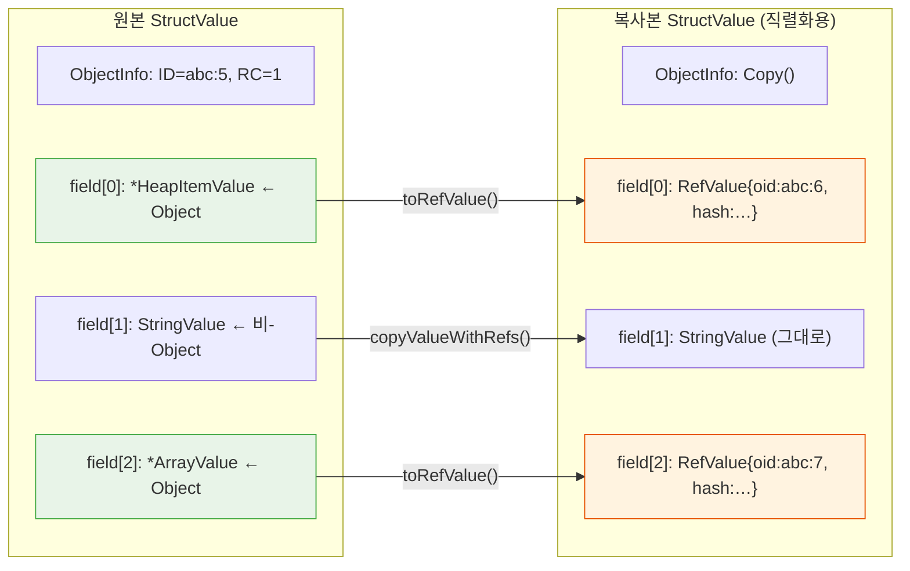

이 변환의 핵심 분기점은 `refOrCopyValue`(`realm.go:1776-1787`)다. `tv.V`가 Object이면 무조건 `toRefValue`로 교체한다. 이 "무조건"이라는 점이 중요하다. 현재 시스템에서는 Object가 부모의 amino 데이터에 직접 포함될 방법이 없다. 모든 Object는 반드시 별도 KV 엔트리를 갖는다.

---

## 4. 역직렬화 경로: KV 엔트리에서 Object까지

### 4.1 loadObjectSafe의 전체 흐름

`store.loadObjectSafe`(`store.go:459-511`)는 KV 스토어에서 하나의 Object를 복원하는 함수다.

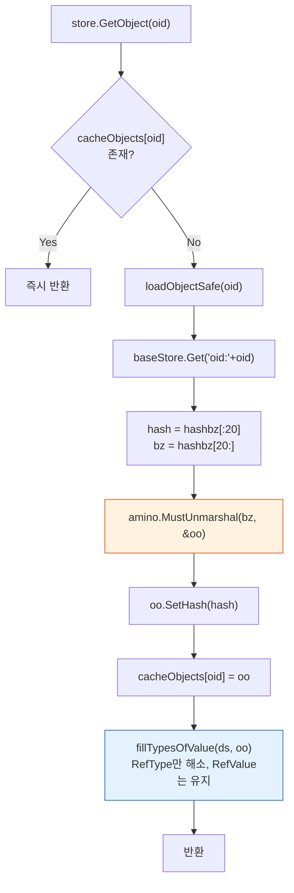

역직렬화된 객체의 필드에는 자식 Object가 아닌 `RefValue`가 들어 있다. 이 RefValue는 VM이 실제로 해당 필드에 접근할 때까지 해소(resolve)되지 않는다. `fillTypesOfValue`는 타입 참조(`RefType`)만 해소하며, 값 참조(`RefValue`)는 건드리지 않는다. 값의 지연 로딩은 `fillValueTV`에서 수행되며, 이는 VM의 필드 접근 연산자나 `PointerValue.GetBase()` 등에서 필요할 때 호출된다.

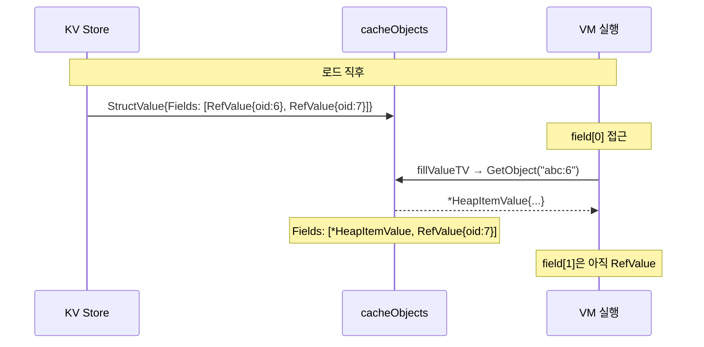

이 지연 로딩 설계는 두 가지 중요한 함의를 갖는다. 첫째, 특정 ObjectID로 `store.GetObject`를 호출했을 때 해당 엔트리가 KV 스토어에 존재하지 않으면 panic이 발생한다(`store.go:432-435`). 이것은 "모든 real Object는 반드시 KV 스토어에 존재해야 한다"는 불변식이다. 둘째, 한 realm의 Object가 다른 realm의 Object를 RefValue를 통해 참조할 수 있으므로, 특정 realm의 Object를 KV에서 제거하면 해당 Object를 참조하는 모든 다른 realm에서 panic이 발생할 수 있다.

---

## 5. 트랜잭션 생명주기: FinalizeRealmTransaction

### 5.1 전체 파이프라인

`FinalizeRealmTransaction`(`realm.go:365-404`)은 realm 트랜잭션의 마무리를 수행하는 7단계 파이프라인이다. 이 함수는 realm 함수 호출이 반환될 때(`OpReturn`) 호출되며, 트랜잭션 중 발생한 모든 객체 변경사항을 영속화한다.

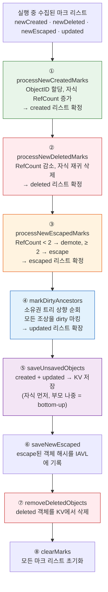

단계의 순서가 중요하다. 1단계(생성)가 2단계(삭제)보다 먼저 실행되는 이유는, 같은 트랜잭션에서 생성과 삭제가 동시에 발생할 수 있고, 최종 RefCount가 1단계의 증가와 2단계의 감소를 모두 반영해야 하기 때문이다. 3단계(escape)가 1, 2단계 뒤에 오는 이유는 RefCount가 확정된 후에야 "진짜 escape인지 아닌지"를 판단할 수 있기 때문이다. 4단계(조상 dirty 마킹)가 5단계(저장)보다 먼저 오는 이유는, 자식이 변경되었으면 부모도 재직렬화되어야 하기 때문이다. 부모의 직렬화 데이터에는 자식의 Hash가 포함되므로, 자식의 Hash가 바뀌면 부모의 Hash도 바뀌어야 한다.

### 5.2 DidUpdate — 변경 추적의 시작점

모든 객체 상태 변경 추적은 `DidUpdate`(`realm.go:178-253`)에서 시작된다. 이 함수는 VM이 값을 할당할 때(`PointerValue.Assign2`에서) 호출되며, 세 가지 인자를 받는다. `po`는 parent object, 즉 필드가 변경된 소유자 구조체다. `xo`는 교체되는 기존 값이고, `co`는 새로 할당되는 값이다.

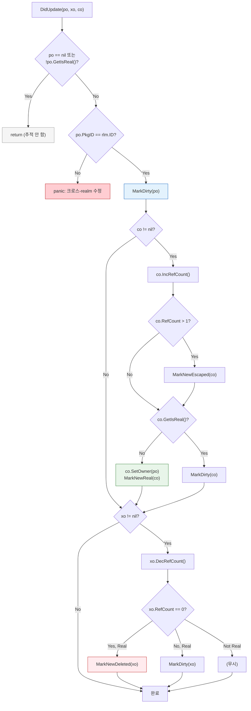

`DidUpdate`의 첫 번째 분기 조건은 `po == nil || !po.GetIsReal()`이다. 이 조건이 true이면 함수는 아무것도 하지 않고 반환한다. 이것은 "비영속 객체의 변경은 추적하지 않는다"는 의미이며, 트랜잭션 중에 생성되었지만 아직 소유권 트리에 합류하지 않은 임시 객체들의 변경은 무시된다. 그러나 이 설계는 동시에 "ObjectID가 없는 객체의 내부 변경은 dirty 전파를 일으키지 않는다"는 결과도 가져온다. 이 사실은 인라인 최적화 시도에서 치명적인 문제를 일으켰다(9.2절 참조).

`DidUpdate`는 또한 `po.GetObjectID().PkgID != rlm.ID`일 때 panic을 발생시킨다. 이것은 한 realm의 코드가 다른 realm의 객체를 직접 수정하는 것을 방지하는 크로스-realm 보호 메커니즘이다.

`DidUpdate`가 호출되는 경로는 `PointerValue.Assign2`(`values.go:217-239`)다. 이 함수는 할당 전에 `pv.TV.GetFirstObject(store)`로 기존 값의 첫 번째 Object를 추출하고, 할당 후에 다시 추출하여 `rlm.DidUpdate(pv.Base.(Object), oo1, oo2)`를 호출한다. 여기서 `pv.Base`는 해당 필드를 소유한 구조체(또는 배열, 블록)로, `DidUpdate`의 `po` 인자가 된다. 이 Base가 real Object여야 dirty 전파가 시작된다.

### 5.3 processNewCreatedMarks — ID 할당과 자식 순회

`processNewCreatedMarks`(`realm.go:402-436`)는 `newCreated` 리스트를 순회하며, RefCount가 0이 아닌 객체에 대해 `incRefCreatedDescendants`를 호출한다. 이 함수가 하는 일은 다음과 같다.

첫째, `assignNewObjectID`를 호출하여 realm의 `Time` 카운터를 증가시키고 새로운 ObjectID를 부여한다. 이 시점에서 객체는 "real"이 된다. 둘째, `created` 리스트에 추가한다. 셋째, `getChildObjects2`로 자식 Object들을 로드(RefValue면 스토어에서 실제 로드)하고, 각 자식의 RefCount를 증가시킨다. RefCount가 1이 된 자식은 새로 소유권 트리에 합류한 것이므로 owner를 설정하고 재귀적으로 `incRefCreatedDescendants`를 호출한다. RefCount가 2 이상이 된 자식은 escape 처리를 위해 `MarkNewEscaped`한다.

이 재귀 과정에서 중요한 것은 "이미 ObjectID가 부여된 객체는 건너뛴다"는 재귀 가드다(`realm.go:458-461`). 이를 통해 같은 객체가 여러 경로에서 참조되더라도 한 번만 처리된다.

### 5.4 processNewDeletedMarks — 삭제 캐스케이드

`processNewDeletedMarks`(`realm.go:517-545`)는 `newDeleted` 리스트를 순회하며, RefCount가 0인 객체에 대해 `decRefDeletedDescendants`를 호출한다. 이 함수는 생성의 역과정이다. 객체에 `isDeleted = true`를 설정하고 `deleted` 리스트에 추가한 후, 모든 자식의 RefCount를 감소시킨다. RefCount가 0이 된 자식은 재귀적으로 삭제하고, 0보다 큰 자식은 dirty로 마킹한다(다른 소유자가 있으므로 재직렬화가 필요).

`decRefDeletedDescendants`(`realm.go:548-575`)에서 특히 주목할 점은 `getChildObjects2(store, oo)`를 사용한다는 것이다. 이 함수는 `getChildObjects`(`realm.go:1069-1145`)를 호출한 후, 결과 중 RefValue인 것을 `store.GetObject`로 실제 로드한다. 즉, 삭제 캐스케이드 과정에서는 자식 Object가 아직 메모리에 없더라도 스토어에서 로드하여 RefCount를 감소시킨다.

### 5.5 markDirtyAncestors — 소유권 트리 상향 순회

`markDirtyAncestors`(`realm.go:647-723`)는 `updated`와 `created` 리스트의 모든 객체에 대해 소유권 트리를 위로 순회하며 조상을 dirty로 마킹한다.

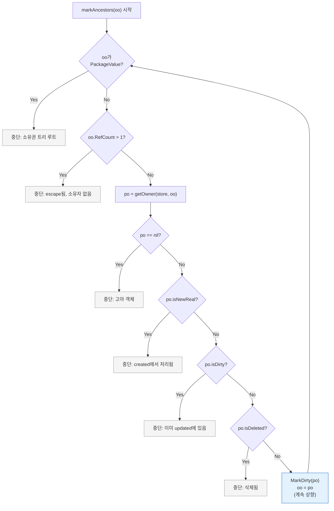

이 상향 순회는 Merkle 해시의 무결성을 보장하기 위해 필수적이다. 자식의 해시가 변경되면 부모의 직렬화 데이터도 바뀌므로(자식의 RefValue에 Hash가 포함되므로), 부모도 재직렬화되어야 하고, 이는 다시 부모의 부모의 해시를 변경시킨다. 이 과정은 PackageValue(소유권 트리의 루트)까지 계속된다.

`markDirtyAncestors`가 `updated`를 먼저 처리하고 `created`를 나중에 처리하는 순서는 의도적이다. `MarkDirty`는 새로운 객체를 `updated` 리스트에 append하는데, range 기반 반복은 append된 새 원소를 포함하지 않으므로, 먼저 `updated`를 처리하면 중간에 추가된 조상들은 `created` 처리 시에 이미 dirty 상태이므로 조기 종료된다.

### 5.6 saveUnsavedObjects — bottom-up 저장

`saveUnsavedObjects`(`realm.go:725-759`)는 두 루프로 구성된다. 첫 번째 루프는 `created` 리스트를 순회하며 `saveUnsavedObjectRecursively`를 호출한다. 이 함수(`realm.go:762-820`)는 먼저 `getUnsavedChildObjects`로 미저장 자식을 찾아 재귀적으로 저장한 후, 자기 자신을 저장한다. 이 bottom-up 순서가 보장되는 이유는, `toRefValue`가 자식의 ObjectID와 Hash를 요구하기 때문이다. 자식이 먼저 `SetObject`를 통해 저장되면 Hash가 계산되고 ObjectID가 확정되므로, 부모의 `copyValueWithRefs`에서 유효한 RefValue를 생성할 수 있다.

두 번째 루프는 `updated` 리스트를 순회하며 `saveObject`를 직접 호출한다. updated 객체는 이미 real이고 자식들도 이미 저장되어 있으므로(created에서 처리되었거나 이전 트랜잭션에서 저장되었으므로), 재귀가 필요 없다.

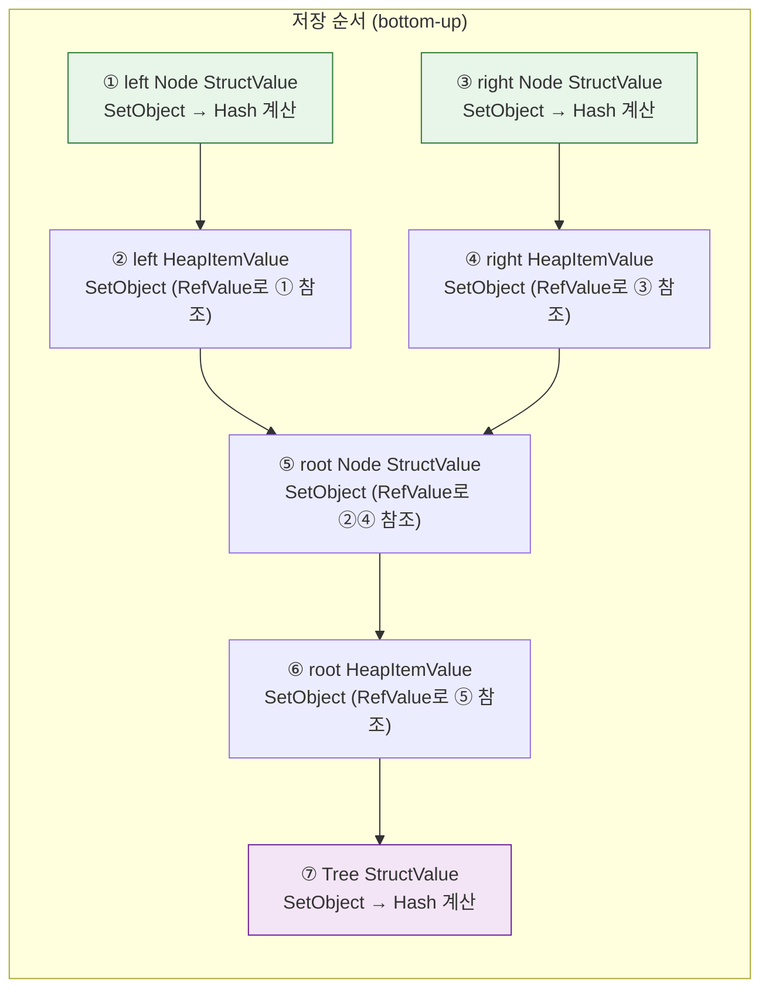

---

## 6. avl.Tree의 Object 체인 상세

avl.Tree의 저장 구조를 이해하는 것은 GnoVM 객체 시스템의 오버헤드를 이해하는 핵심이다. 5개 엔트리를 가진 tree의 경우, 노드 하나당 HeapItemValue + StructValue(Node) 두 개의 Object가 생성되며, 루트에 Tree StructValue까지 합하면 총 11개의 독립 KV 엔트리가 만들어진다.

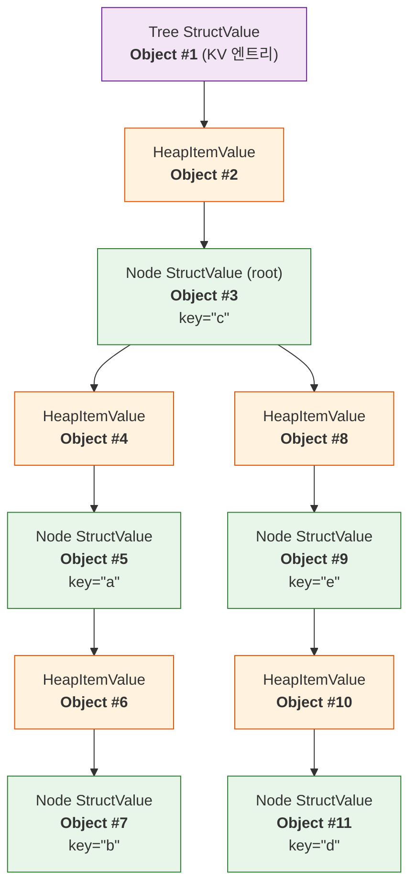

각 KV 엔트리에는 ObjectInfo(~93바이트), 해시(20바이트), 값 데이터(~60바이트)가 포함되어 엔트리당 약 173바이트가 소요된다. 반면 실제 유효 데이터(key + value)는 약 30바이트에 불과하다. 5개 엔트리의 tree에서 11개 Object × ~173 bytes = ~1,900 bytes가 소요되지만 유효 데이터는 5 × ~30 bytes = ~150 bytes여서, 효율은 약 8%에 그친다. 이 약 13배의 오버헤드가 avl.Tree 기반 스마트 컨트랙트(예: GnoSwap DEX)의 스토리지 비용을 크게 높이는 원인이다.

---

## 7. dirty 전파 메커니즘의 전체 경로

값이 변경될 때부터 KV 스토어에 반영되기까지의 전체 경로를 추적한다. avl.Tree에서 단 하나의 노드를 수정해도, 루트까지 올라가는 경로의 모든 Object와 HeapItemValue가 재직렬화된다.

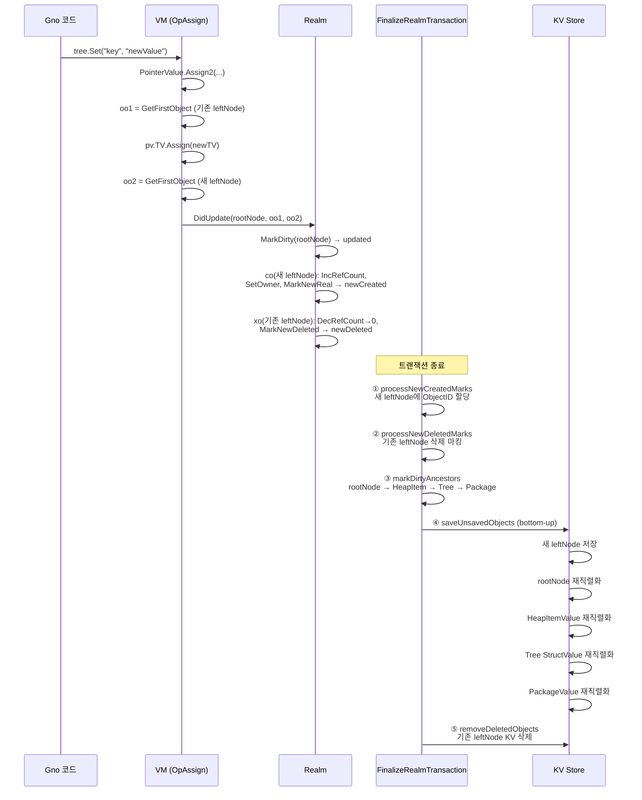

트리 깊이가 D일 때 재직렬화되는 Object 수는 약 `2*D + 2`개(HeapItemValue + Node StructValue 쌍 × 깊이 + Tree + Package)다. 이 비용은 트리 크기가 아닌 깊이에 비례하므로, balanced tree의 경우 O(log N)이다.

---

## 8. escape 메커니즘

동일 Object가 두 곳 이상에서 참조되면 escape가 발생한다. escape된 Object는 소유권 트리에서 분리되어 독립적으로 영속화된다.

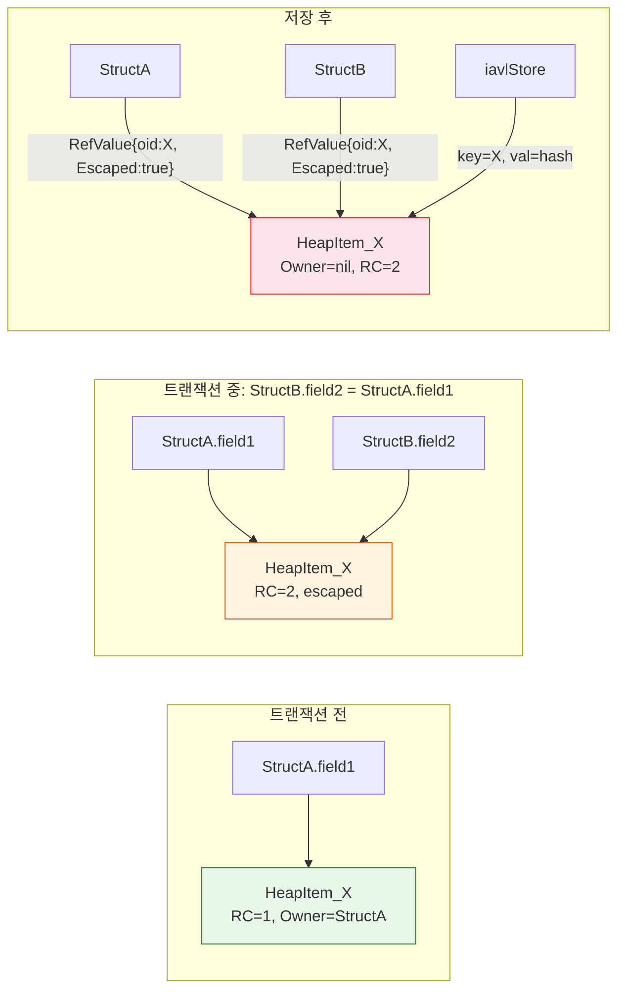

escape된 객체의 RefValue에는 Hash가 없고 `Escaped: true`만 있다. 이것은 escape된 객체의 해시가 IAVL 트리에 별도로 저장되기 때문이다. 부모의 해시 계산 시 escape된 자식의 해시는 포함되지 않으므로, escape된 자식의 내용이 변경되어도 부모의 해시는 변하지 않는다. 대신 IAVL 트리의 해시가 변경되며, 이것이 전체 state root에 반영된다.

escape의 해소(demote)는 RefCount가 다시 1로 돌아올 때 `processNewEscapedMarks`에서 처리된다. escape 해소 시 객체는 다시 소유권 트리에 합류하며, 소유자가 설정되고 IAVL의 별도 엔트리는 제거된다.

---

## 9. 인라인 최적화 시도에서 발견된 구조적 제약

avl.Tree의 per-node 오버헤드를 줄이기 위해, 작고 단일 소유된 Object를 부모의 KV 엔트리에 인라인으로 포함시키는 최적화를 시도했다. 이 과정에서 발견된 구조적 제약들은 GnoVM 객체 시스템의 깊은 불변식을 드러낸다.

### 9.1 "모든 real Object는 독립 KV 엔트리를 갖는다"는 불변식

이것은 시스템 전반에 걸쳐 암묵적으로 가정되는 핵심 불변식이다. `store.GetObject(oid)`는 ObjectID로 KV 스토어를 조회하여 Object를 반환하며, 찾지 못하면 panic한다. 이 함수는 realm 경계를 넘어 호출될 수 있다. 예를 들어, realm A의 Block이 realm B의 PackageValue를 RefValue로 참조하고 있다면, realm B의 Package 로딩 시 `store.GetObject`가 호출된다.

인라인 최적화에서 특정 Object의 별도 저장을 생략하면, 해당 ObjectID로의 조회가 실패한다. 이 문제는 같은 realm 내에서는 메모리 캐시를 통해 우회할 수 있지만, genesis 과정처럼 여러 realm이 순차적으로 배포될 때 치명적이다. realm A가 배포되면서 inline 저장된 Object의 ID가 realm B의 코드에서 참조될 수 있으며, realm B가 로드될 때 해당 ID의 KV 엔트리가 없어 panic이 발생한다.

### 9.2 DidUpdate의 po.GetIsReal() 게이트

`DidUpdate`는 po(parent object)가 real이 아니면 아무것도 하지 않고 반환한다. 인라인된 Object는 ObjectID가 zero이므로 `GetIsReal()`이 false를 반환하고, 그 결과 해당 Object 내부의 값 변경이 dirty 전파를 일으키지 않는다. 부모(인라인 Object를 포함하는 상위 Object)가 dirty로 마킹되지 않으므로, 변경사항이 KV 스토어에 반영되지 않고 사라진다.

이 문제를 해결하려면 인라인 Object에서 가장 가까운 real 조상까지 소유권 체인을 따라 올라가는 `findRealAncestor` 함수가 필요하다. 그러나 이 접근법은 `DidUpdate`의 `co`/`xo` 처리 로직과 상호작용할 때 추가적인 복잡성을 낳는다. 인라인 Object가 `po` 역할을 할 때, 새로 할당되는 `co`의 Owner를 누구로 설정해야 하는지(인라인 Object? real 조상?)의 문제가 발생하며, 이는 이후 `markDirtyAncestors`에서의 소유권 체인 순회에 영향을 미친다.

### 9.3 삭제 경로에서의 RefValue 누수

인라인 Object가 교체(삭제)될 때, `DidUpdate`의 xo 처리에서 `xo.GetIsReal()` 검사를 통과하지 못하므로 `MarkNewDeleted`가 호출되지 않는다. 인라인 Object 자체는 부모의 재직렬화에서 자연스럽게 제거되지만, 인라인 Object 내부에 RefValue로 참조하던 비인라인 자식의 RefCount는 감소하지 않는다.

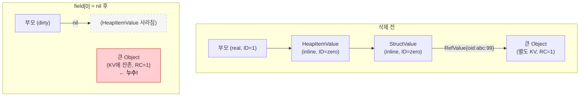

이 문제를 해결하려면 인라인 Object가 삭제될 때 그 내부의 RefValue들을 수집하여, `FinalizeRealmTransaction`에서 store 접근이 가능한 시점에 해당 Object들의 RefCount를 감소시키는 별도 메커니즘이 필요하다.

### 9.4 saveUnsavedObjectRecursively의 bottom-up 전제

`saveUnsavedObjectRecursively`는 `getUnsavedChildObjects`로 미저장 자식을 찾아 먼저 저장한다. 이 함수는 내부적으로 `getChildObjects` → `getSelfOrChildObjects`를 사용하는데, 여기서 Object로 식별되는 값은 "별도 저장 대상"으로 분류된다. 인라인 최적화에서 특정 Object를 "별도 저장하지 않음"으로 분류하면, 부모가 저장될 때 해당 Object의 데이터가 부모의 amino 데이터에 포함되어야 한다. 그런데 `copyValueWithRefs`의 `refOrCopyValue`는 Object를 만나면 무조건 `toRefValue`로 교체하므로, 인라인 Object의 데이터가 부모에 포함될 방법이 없다.

이 문제를 해결하려면 `refOrCopyValue`에서 인라인 대상 Object를 RefValue가 아닌 인라인 복사본으로 교체하는 `copyValueInline` 경로를 추가해야 한다. 그러나 이는 amino 역직렬화에서 해당 데이터를 올바르게 복원하는 것, 복원된 인라인 Object에 소유권을 재설정하는 것, 그리고 인라인 Object의 Hash가 부모의 Hash에 포함되므로 Merkle proof 구조가 변경되는 것 등 연쇄적인 변경을 요구한다.

### 9.5 결론: 인라인 최적화의 실행 가능성

위의 분석은 인라인 최적화가 기술적으로 불가능하다는 것을 의미하지 않는다. 다만, 이 최적화가 GnoVM 객체 시스템의 최소 5가지 핵심 경로(직렬화, 역직렬화, dirty 전파, 삭제 캐스케이드, 크로스-realm 참조)에 동시에 영향을 미치며, 각 경로의 수정이 다른 경로와 상호작용하는 방식을 세밀하게 고려해야 한다는 것을 보여준다. 단순히 "작은 Object의 별도 저장을 건너뛴다"가 아니라, Object의 "현실성(reality)" 개념 자체를 재정의하는 수준의 변경이 필요하며, 이는 철저한 통합 테스트와 genesis 시나리오 검증을 수반해야 한다.

---

## 부록 A. 주요 함수 참조 테이블

| 함수명 | 파일:라인 | 역할 |
|--------|-----------|------|
| `FinalizeRealmTransaction` | `realm.go:365` | 트랜잭션 마무리 파이프라인 |
| `DidUpdate` | `realm.go:178` | 값 변경 추적 시작점 |
| `MarkNewReal` | `realm.go:244` | 새 Object → newCreated |
| `MarkDirty` | `realm.go:275` | 수정된 Object → updated |
| `MarkNewDeleted` | `realm.go:295` | 삭제 대상 → newDeleted |
| `MarkNewEscaped` | `realm.go:315` | escape 대상 → newEscaped |
| `processNewCreatedMarks` | `realm.go:402` | ID 할당, 자식 RefCount 증가 |
| `incRefCreatedDescendants` | `realm.go:439` | 재귀적 생성 처리 |
| `processNewDeletedMarks` | `realm.go:517` | 삭제 캐스케이드 시작 |
| `decRefDeletedDescendants` | `realm.go:548` | 재귀적 삭제 처리 |
| `processNewEscapedMarks` | `realm.go:576` | escape 확정/해제 |
| `markDirtyAncestors` | `realm.go:647` | 조상 dirty 전파 |
| `saveUnsavedObjects` | `realm.go:725` | created/updated 저장 |
| `saveUnsavedObjectRecursively` | `realm.go:762` | bottom-up 재귀 저장 |
| `removeDeletedObjects` | `realm.go:862` | KV에서 삭제 |
| `copyValueWithRefs` | `realm.go:1324` | 직렬화용 복사 (Object → RefValue) |
| `refOrCopyValue` | `realm.go:1776` | Object/비-Object 분기 |
| `toRefValue` | `realm.go:1702` | Object → RefValue 변환 |
| `getSelfOrChildObjects` | `realm.go:1057` | 자식 Object 열거 |
| `getChildObjects` | `realm.go:1069` | 값별 자식 순회 |
| `getChildObjects2` | `realm.go:1146` | RefValue 로드 포함 |
| `getUnsavedChildObjects` | `realm.go:1170` | 미저장 자식 필터 |
| `SetObject` | `store.go:619` | KV 저장 (amino 직렬화) |
| `loadObjectSafe` | `store.go:459` | KV 로드 (amino 역직렬화) |
| `GetObject` | `store.go:427` | 캐시 → KV 조회 (없으면 panic) |
| `fillValueTV` | `values.go` | RefValue → 실제 Object 지연 로딩 |
| `Assign2` | `values.go:217` | 값 할당 + DidUpdate 호출 |
| `getOwner` | `realm.go:1829` | 소유자 로드 (캐시) |

## 부록 B. 객체 상태 전이 다이어그램

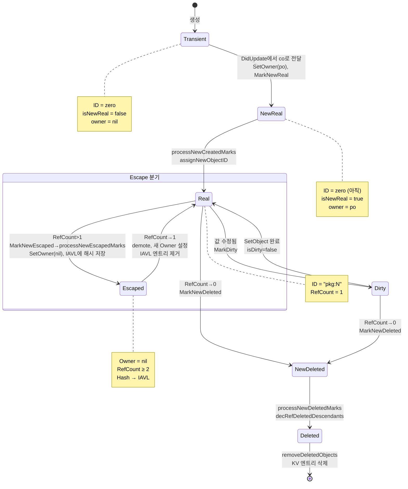
